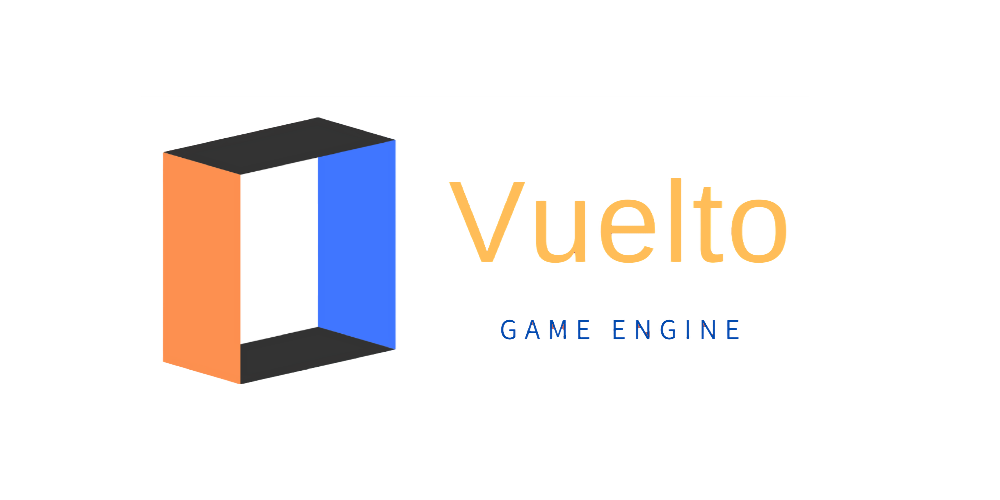

<h1 align="center">
<p align="center">


<p align="center">
  <a href="https://github.com/vuelto-org/vuelto"></a>
  <a href="https://github.com/vuelto-org/vuelto"></a>
  <a href="https://github.com/vuelto-org/vuelto"></a>
  <a href="https://github.com/vuelto-org/vuelto"></a>
  <a href="https://goreportcard.com/report/github.com/vuelto-org/vuelto"></a>
</p>

</h1>

Vuelto is a fast and lightweight Go game engine which uses CGo and OpenGL to display your graphics. It is really easy to start with, but it can be really powerful to work with. It's cross-platform, meaning that every game you make with Vuelto will work on Windows, Linux and Mac. It's also open-source, meaning that you can see the source code and contribute to the engine. Have fun!


## 📑 Table of Contents
 - [Usage](#usage)
 - [Contributing](#contributing)
 - [Website+Docs](https://vuelto-org.github.io/vuelto/)
 - [Discord Server](https://discord.gg/gZqdRXbbqg)
 - [Roadmap](#roadmap)
 - [License](#license)
 - [About](#about)


## 🚀 Usage
### 🛠️ Requirements
There are some extra things you will need to use Vuelto.
- A C compiler
- A Go compiler
- Xorg development packages (For Linux only)

For a installation guide, [go here](https://vuelto-org.github.io/vuelto/install/).

### 📦 Go package
We have a Go package published, so run this command to add it to your go.mod:
```bash
go get vuelto.me@latest
```

### 🌟 Examples
All of our examples are inside the examples directory, so take a look there is you want a example. Here one small example of how easy Vuelto is:
```go
package main

import (
	vuelto "vuelto.me/pkg"
)

func main() {
	w := vuelto.NewWindow("Image Example - Vuelto", 800, 600, false)
	ren := w.NewRenderer2D()

	image := ren.LoadImage("your_image1.png", 300, 300, 250, 250)
	image1 := ren.LoadImage("your_image2.png", 100, 100, 150, 150)

	for !w.Close() {
		image.Draw()
		image1.Draw()
		w.Refresh()

	}
}

```

## 📚 Docs
Our docs are hosted on our website, so go [here](https://vuelto-org.github.io/vuelto/) to see them.
	

## 📋 Roadmap
You can find our [roadmap on the website](https://vuelto-org.github.io/vuelto/roadmap/v1).


## 🎉 Discord server
We have a [discord server at this link](https://discord.gg/gZqdRXbbqg). It's a fun server mainly created for vuelto, but you can talk about whatever you want.

## 🤝 Contributing
We are fully open to contributions, but I will check and test your code before merging it into the dev branch. All your code thats accepted will only be merged into the dev branch, and will be later released with the next release.

## 🔐 License
Vuelto is licensed under the [GPLv3 Licence](LICENSE).

## ℹ️ About
Vuelto is a game engine powered by CGo and OpenGL. It leverages the power of Go to create a fast and lightweight game engine. It's cross-platform, meaning that every game you make with Vuelto will work on Windows, Linux and Mac. It's also open-source, meaning that you can see the source code and contribute to the engine. We have created this engine so you can create your graphical application fast and easy.
Made by the Vuelto Team :heart:
