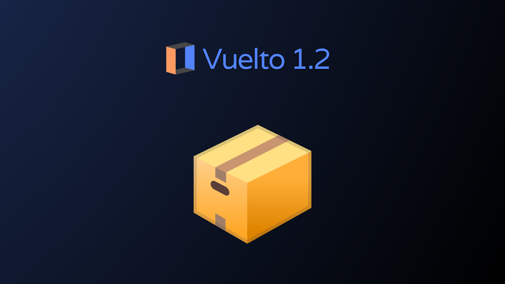

# 📦 Vuelto's Box2D and more

Hey there and welcome! This time were gonna take a look at Vuelto's fresh Box2D system, made for simplifying the management of entities inside of vuelto. This will be a little more
in depth than usual, so strap in, get some popcorn and lets go!

<!-- more -->

## 📝 Approach/profile
Different users like different API's. While some like total control, others prefer simplicity. So in Vuelto's case, we're splitting it into two profiles:

1. Box profile
2. Renderer profile

Number two is the old and basic approach where you create a window, create a renderer and do stuff. Pure basics. Number one on the other hand, gives you a more tuned experience,
like in bigger game engines. It's task is to implement a basic solution of ECS inside of Vuelto. This is not simple, as vuelto is **not** an object oriented language.

The standard approach/profile will be the renderer profile, while the box profile is an optional feature. The Renderer Profile does **not** include any Collisions/Areas, this is purely due to limitation issues and time constrains.

## ❓ Why?
"Sooo, why should I use it?" you might ask, and that's a fair question. Here's a couple of benefits why:

1. Easier management: Boxes might help you keep your codebase a little cleaner by giving an easier approach to having things like characters (it it might end up the other way)
2. Collision management: One of the cool features is Areas and collisions, which should make development a little easier :)
3. Parent/child Box: A change to the parent Box will also be applied to child boxes
There might be also other reasons which are not covered here.

## ⚙️ How it works
A Box is basically your playground, your "virtual screen", that's how you can see it. It can exists out of multiple child boxes, or just be a single sprite. It can be scaled, moved,
checked for collision, it can do a lot of stuff.

### 🔧 Basic principle
A box exists out of multiple parts:

1. Scale: The scale of the Box2d, effecting the children too
2. Position / Size: The bare position and size of the box, which effects the child Box2D too
3. Sprites: The picture attachments into your current Box2D
4. Child boxes: Sub-boxes which take effects of its parent box, and which can be manipulated together/alone

A Box2D can also be used for physics/collision. For that, you assign it settings. In those settings you define the characteristics of the Box, like whether it's static or rigid, or if it's affected by any force like gravity or velocity.

### 🧱 Collisions
Collisions are another benefit to using Box2D. Collision is usually pretty complicated to implement, and can be done in a lot of different ways. What vuelto does is detaching collision management to a separate thread in order to improve the main loops speed, and to not increase the overhead on the main thread. This benefits that the collision checker does not depend on the loops speed and has a faster "reaction time". When the collision checker detects collision, it sends a signal to main thread from where actions happen.

### 📍 Areas
Areas are handy if you're searching for a way to check if multiple objects are overlapping. It leverages collision detection code, but rather than colliding and executing an action, it gives you the control to do whatever you want. This of course runs on the collision checker thread. Multiple can be created, and all of them have require a fallback function defined by user in order to function correctly. 

## 🗂️ Schematics
Pretty much every big idea I get for vuelto, I sketch up. And of course, I made a small schematics/diagram for this too! :)

