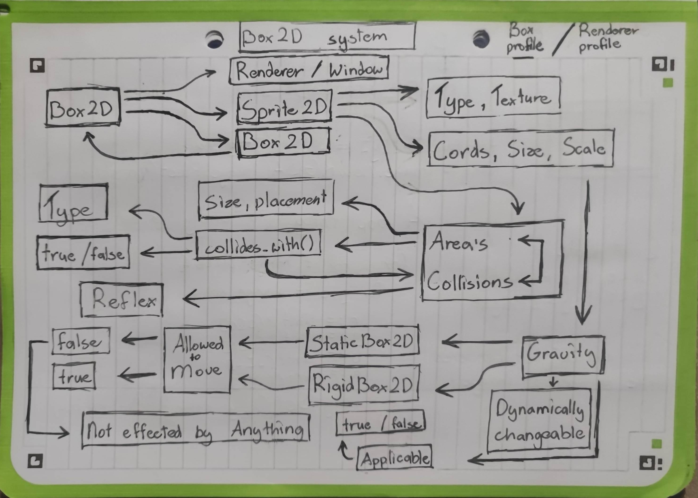

# 📦 Vuelto's Box2D and more
Hey there and welcome! This time were gonna take a look at Vuelto's fresh Box2D system, made for simplifying the managment of entities inside of vuelto. This will be a little more
in dept than usual, so strap in, get some popcorn and lets go!

## Approach/profile
Different users like different API's. While some like total control, others prefer simplicity. So in Vuelto's case, we're splitting it into two profiles:
1. Box profile
2. Renderer profile

Number two is the old and basic approach where you create a window, create a renderer and do stuff. Pure basics. Number one on the other hand, gives you a more tuned experience,
like in bigger game engines. It's task is to implement a basic solution of ECS inside of Vuelto. This is not simple, as vuelto is **not** an object oriented language.

The standard approach/profile will be the renderer profile, while the box profile is an optional feature.

## Why?
"Sooo, why should I use it?" you might ask, and that's a fair question. Here's a couple of benefits why:
1. Easier managment: Boxes might help you keep your codebase a little cleaner by giving an easier approach to having things like characters (it it might end up the other way)
2. Collision managment: One of the cool features is Areas and collisions, which should make development a little easier :)
3. Parent/child Box: A change to the parent Box will also be applied to child boxes
There might be also other reasons which are not covered here.

## How it works
A Box is basically your playground, your "virtual screen", thats how you can see it. It can exists out of multiple child boxes, or just be a single sprite. It can be scaled, moved,
cheked for collision, it can do a lot of stuff.

### Basic principle
A box exists out of multiple parts:
1. Scale: Its scale, which effects everything child of the box
2. Position / Size: The bare position and size of the box, defaults to the window information, but can be overwritten

## Schematics
Pretty much every big idea I get for vuelto, I sketch up. And of course, I made a small schematics/diagram for this too! :)

